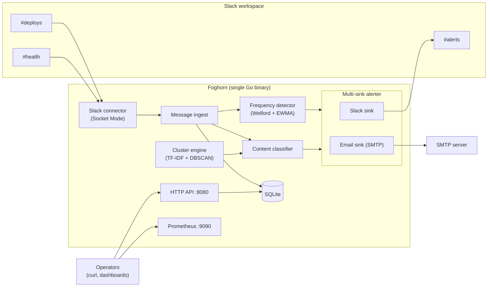
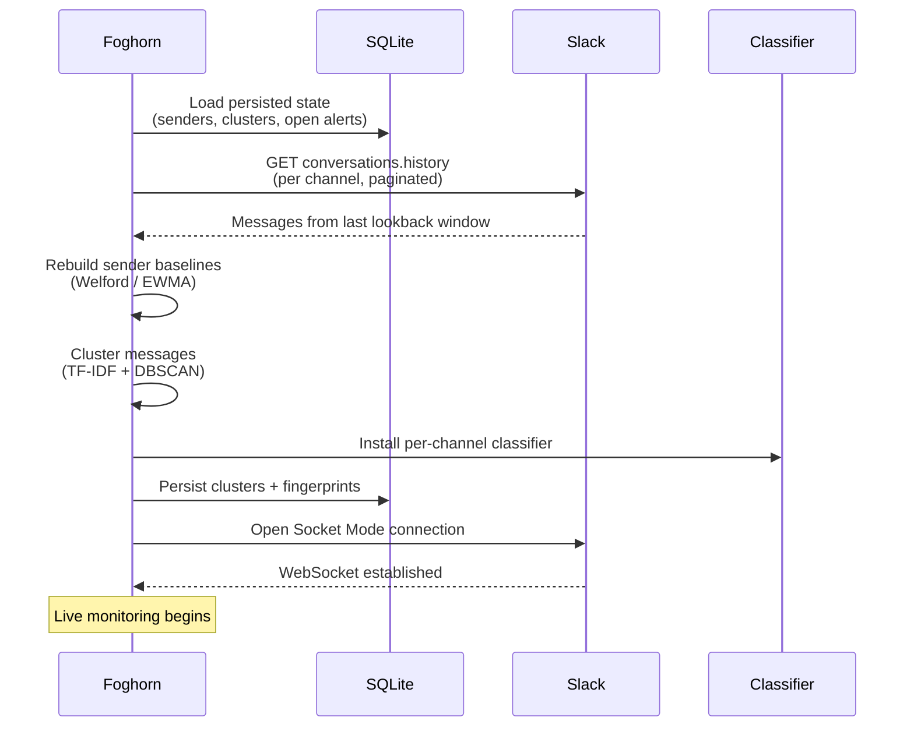
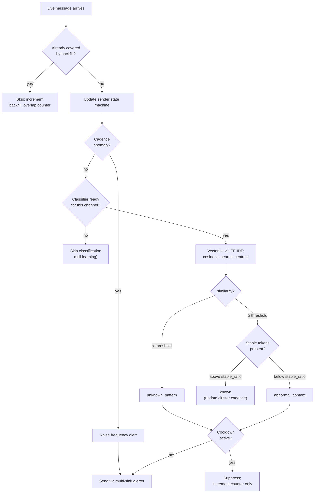

<p align="center">
  
</p>

# Foghorn

Foghorn watches Slack channels where services post status messages, learns what "normal" looks like for each channel and sender via deterministic clustering, and alerts when something deviates. It's a single Go binary against a SQLite file, with no external AI services and no cloud dependencies. Built for DevOps engineers who want their existing Slack channels to behave like a passive heartbeat monitor.

## Quick start

### 1. Create the Slack app

Foghorn ships a [Slack app manifest](slack/manifest.yaml) that defines every scope, event subscription, and setting the bot needs. To install:

1. Go to <https://api.slack.com/apps> and click **Create New App** then **From an app manifest**.
2. Pick your workspace.
3. Paste the contents of [`slack/manifest.yaml`](slack/manifest.yaml).
4. Confirm and create the app.

### 2. Generate tokens

Two Slack tokens are required, plus a bearer token of your choice for Foghorn's HTTP API.

- **App-Level Token** (`xapp-...`): on the app's **Basic Information** page, scroll to *App-Level Tokens* and generate one with the `connections:write` scope. This drives the Socket Mode WebSocket.
- **Bot User OAuth Token** (`xoxb-...`): on the **Install App** page, install to the workspace, then copy the bot token shown.
- **API token**: any secret you want Foghorn's read API to accept. Generate one with `openssl rand -hex 32`.

### 3. Invite the bot to channels

In every Slack channel you want Foghorn to monitor:

    /invite @Foghorn

Foghorn auto-discovers channels the bot is a member of at boot; you don't need to copy channel IDs into config unless you want to restrict to a subset.

### 4. Build and run

    git clone https://github.com/alexmchughdev/foghorn
    cd foghorn
    make build

    export SLACK_APP_TOKEN=xapp-...
    export SLACK_BOT_TOKEN=xoxb-...
    export FOGHORN_API_TOKEN=...

    cp examples/foghorn.yaml foghorn.yaml   # optional: tweak detection knobs
    ./foghorn run -config foghorn.yaml

To verify the Slack app, scopes, and channel access without starting the worker:

    ./foghorn check -config foghorn.yaml

By default Foghorn monitors every channel the bot is in. To restrict to a subset, set `connectors[].monitor` in `foghorn.yaml` to a list of channel names (`#deploys`) or IDs (`C0B3Q17FZ2L`):

```yaml
connectors:
  - name: prod-slack
    type: slack
    app_token_env: SLACK_APP_TOKEN
    bot_token_env: SLACK_BOT_TOKEN
    monitor:
      - "#deploys"
      - "#health"
```

## Deployment

Pre-built multi-architecture images are published to GitHub Container Registry on every push to `main` and on tagged releases. The image is `linux/amd64` and `linux/arm64`.

### Docker

```bash
docker run -d \
  --name foghorn \
  -e SLACK_BOT_TOKEN=xoxb-... \
  -e SLACK_APP_TOKEN=xapp-... \
  -e FOGHORN_API_TOKEN=$(openssl rand -hex 32) \
  -v $(pwd)/data:/var/lib/foghorn \
  -p 8080:8080 -p 9090:9090 \
  ghcr.io/alexmchughdev/foghorn:latest
```

Image tags:

- `latest`: current `main`.
- `sha-<full-git-sha>`: any pushed commit.
- `<tag>`: any pushed git tag (e.g. release tags).

### Docker Compose

A reference [`docker-compose.yml`](docker-compose.yml) ships at the repo root for the common single-host case:

```bash
git clone https://github.com/alexmchughdev/foghorn
cd foghorn
cp .env.example .env
$EDITOR .env             # fill in the three tokens
docker compose up -d
```

The compose file mounts `./data` for the SQLite store and exposes both the API and metrics ports. `.env.example` lists every required variable and shows how to generate the API bearer token.

### Kubernetes

Reference manifests live in [`deploy/k8s/`](deploy/k8s/) (Deployment, Service, PVC, ConfigMap, ExternalSecret for token wiring) and an ArgoCD `Application` in [`deploy/argocd/`](deploy/argocd/). The Deployment runs as non-root, mounts the SQLite store on a PVC, and exposes both the API and metrics ports.

## Architecture



Foghorn is one binary that runs two cooperating halves on shared state: a worker that ingests Slack events and runs detection, and an HTTP API that exposes the worker's state. Both halves share one SQLite handle and one root context, so process shutdown is a single cancellation.

The chat platform sits behind a `Connector` interface so detection and alerting never depend on Slack-specific code. Today the only implementation is Socket Mode (outbound WebSocket, no inbound webhooks required). A second platform plugs in by implementing the interface and adding one config entry.

Detection is deterministic and self-contained. TF-IDF, cosine similarity, and DBSCAN are all implemented in-tree against the standard library. No calls to external classifiers, no embedding APIs, no model files. The SQLite driver is `modernc.org/sqlite` so the binary stays CGO-free and ships as a single static executable.

## How it works



The startup pattern is "learn from history, then monitor live." Foghorn can't classify a message against clusters that don't exist yet, so it pulls a configurable lookback window from `conversations.history` at boot and uses it to build cluster fingerprints before the live socket comes up. Resuming from the SQLite file means a restart doesn't lose sender baselines or open alerts: a five-second crash and a five-day outage both produce the same post-boot state.

Once the classifier is installed, Foghorn opens its Socket Mode connection. Socket Mode is outbound only, which is what makes Foghorn deployable as a regular pod in a private network without firewall holes or public endpoints. A side-effect of Slack's catch-up redelivery on reconnect is that some messages can arrive via both `History` and the live stream within one boot; a per-channel watermark recorded during backfill drops the duplicates before they reach ingest, with a `foghorn_messages_skipped_total{reason="backfill_overlap"}` counter exposing how often this happens.

## Detection



Foghorn raises four kinds of alert, split across two detection paths. Frequency and missing-pattern alerts come from cadence math; unknown- and abnormal-content alerts come from the content classifier. Every alert fans out concurrently to every configured sink (Slack post and SMTP email today, both first-class). The per-(channel, kind) cooldown keeps one incident from producing a storm.

### Frequency drift and offline

Per (sender, channel) Foghorn maintains a Welford running mean and an exponentially-weighted standard deviation of inter-arrival times. A sender is **drifting** when silence exceeds `drift_sigma` standard deviations past its baseline and **offline** when silence exceeds `offline_multiplier × mean_interval`, capped by `hard_cap`. A message arriving while drifting or offline drives a **recovering** transition and clears the open alert.

### Missing pattern

Each cluster has its own cadence baseline, seeded from inter-arrival times of cluster members during the learn pass. When silence on a cluster exceeds the same offline threshold logic, Foghorn raises `missing_pattern`. This catches "the build-success messages stopped" without depending on which sender posts them.

### Unknown pattern

A live message is vectorised against the channel's TF-IDF dictionary and compared by cosine similarity against every cluster centroid. If the best match is below `match_threshold`, nothing in history looks like this and Foghorn raises `unknown_pattern`. This is the "someone said something weird" alert.

### Abnormal content

If a message clears `match_threshold` but is missing more than `1 - stable_ratio` of the matched cluster's stable tokens, it's `abnormal_content`. Stable tokens are the structural words that recur across all cluster members (verbs like `succeeded`, `FAILED`, `started`), excluding values that the templatiser already normalised (numbers, durations, SHAs, URLs). This is the "shape's right but the verb is wrong" alert.

## Configuration

The full schema is in `examples/foghorn.yaml`. Key knobs:

| Field | Meaning |
| --- | --- |
| `connectors[]` | One entry per chat platform connection. `type: slack` is the only implementation today. Each connector lists the channels it monitors. |
| `learning.lookback` | How far back to scan history at boot. The cluster engine needs enough corpus to find structure. |
| `cluster.epsilon`, `cluster.min_pts` | DBSCAN parameters. Lower epsilon, tighter clusters; higher min_pts, fewer clusters and more noise. |
| `cluster.match_threshold` | Cosine threshold for a live message to match a cluster. Below this, the message is `unknown_pattern`. |
| `cluster.stable_ratio` | Fraction of a cluster's stable tokens that must be present in a matched message to count as `known` rather than `abnormal_content`. |
| `detection.drift_sigma`, `detection.offline_multiplier`, `detection.hard_cap` | Frequency-detector thresholds. |
| `alerts.cooldown_per_kind` | How long after a content alert before the same (channel, kind) can fire again. |
| `alerters[]` | One entry per outbound sink. `type: slack` posts to a channel; `type: email` sends SMTP. All sinks fire concurrently for every alert. |

Tuning these against synthetic data is misleading. The defaults exist as starting points; real production corpora will want adjustment after a few days of observation.

## HTTP API

A read API plus one mutating endpoint, on a separate port from metrics.

| Method | Path | Auth | Purpose |
| --- | --- | --- | --- |
| GET | `/healthz` | none | Liveness probe. |
| GET | `/version` | none | Returns the build's git SHA and the process's started-at timestamp. |
| GET | `/clusters?channel=C123` | bearer | Learned clusters for a channel (or all channels if omitted). |
| GET | `/senders` | bearer | Per-sender state and last-seen timestamps. |
| GET | `/alerts?state=open` | bearer | Open alerts (or all alerts if `state` omitted). |
| POST | `/relearn?channel=C123` | bearer | Drop and rebuild clusters for one channel from the current lookback window. |

Bearer auth uses the env var named by `api.token_env` (defaulting to `FOGHORN_API_TOKEN`). The binary refuses to start if that variable is unset, so the API never accidentally serves authenticated endpoints with an empty token.

## Operations

[`docs/OPERATIONS.md`](docs/OPERATIONS.md) covers what to do when something looks off in production: tuning the cluster engine against real corpora, the cross-boot alert lifecycle, troubleshooting heuristics, and known issues with proposed fixes.

For pre-deployment validation, `foghorn check -config foghorn.yaml` runs the same Slack-auth, scope, and channel-access checks the worker does at boot, exits 0 on success or non-zero with an actionable error. Suitable for CI and pre-rollout smoke tests; doesn't open Socket Mode, doesn't touch the SQLite store.

## Package layout

    cmd/foghorn/         main binary entrypoint
    internal/app/        worker wiring: ingest, ticker, relearn, connector + alerter factories
    internal/config/     YAML loader, schema, and backwards-compat shims
    internal/connector/  Connector interface
      slack/             Slack Socket Mode implementation
    internal/cluster/    TF-IDF, cosine, DBSCAN, fingerprinting (pure Go, no external ML libs)
    internal/detect/     Rolling baseline state machine + content classifier
    internal/alerter/    Multi-sink alerter; Slack and email implementations
    internal/store/      SQLite persistence via modernc.org/sqlite (CGO-free)
    internal/api/        HTTP API server, handlers, bearer auth
    internal/metrics/    Prometheus /metrics endpoint
    deploy/              Dockerfile, Kubernetes manifests, ArgoCD application
    examples/            Sample foghorn.yaml
