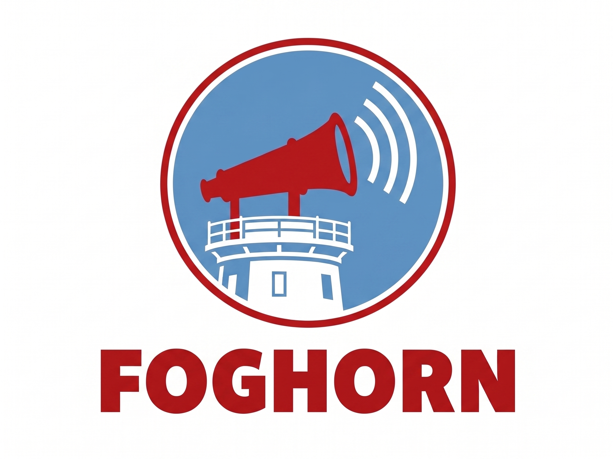

  

# Foghorn

Anomaly detector for service-status messages on Slack.

Foghorn listens to Slack channels where services post status messages, learns what "normal" looks like for each channel and sender, and alerts when reality drifts from that baseline. Detection is deterministic and self-contained, with no external AI services.

## Detection

Foghorn raises four kinds of alert:

- **frequency drift**: a sender's cadence has slipped beyond `drift_sigma` standard deviations of its rolling baseline.
- **offline**: a sender has been silent for longer than `offline_multiplier × mean_interval` (capped by `hard_cap`).
- **unknown pattern**: a live message doesn't match any cluster learned from the channel's history.
- **abnormal content**: a message matches a cluster but is missing the stable tokens the cluster is built around (e.g. a `FAILED` where `SUCCEEDED` is expected).

The first two come from a per-sender rolling-baseline state machine. The latter two come from a content classifier built on a pure-Go TF-IDF + cosine + DBSCAN clustering engine. Cluster fingerprints are learned at boot from a backfill of channel history, then matched against live messages.

Alerts are gated by a per-(channel, kind) cooldown so a single incident doesn't fan out into a storm.

## Alerting

Every alert fans out concurrently to all configured sinks. Slack channel posts and SMTP email are first-class and run in parallel, not alternatives. Adding a new sink (PagerDuty, webhook, etc.) is a matter of implementing the `Alerter` interface.

## Build

    make build
    ./foghorn -config examples/foghorn.yaml

## Layout

    cmd/foghorn/                 main binary
    internal/app/                worker wiring (ingest, ticker, alerts)
    internal/config/             YAML config loader
    internal/store/              SQLite persistence (modernc.org/sqlite, CGO-free)
    internal/connector/          Connector interface
      slack/                     Slack Socket Mode implementation
    internal/cluster/            TF-IDF, cosine, DBSCAN, fingerprints (pure Go)
    internal/detect/             rolling baseline + state machine + content classifier
    internal/alerter/            multi-sink alerter (Slack + email)
    internal/metrics/            Prometheus /metrics
    deploy/                      Dockerfile, K8s manifests, ArgoCD app
    examples/                    sample foghorn.yaml
